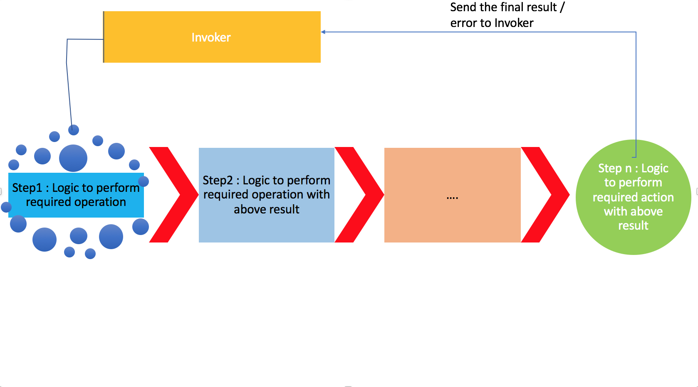

# Issue:
```
Too many waterfall like functions that use output from previous methods
```

# Solution
```
Provides details on executing multiple functions typically as pipe and return the final output to the invoker.
```


# How to use?
### To unit test & get coverage:
```
npm run test
```

### To see demo:
```
npm run start
```

